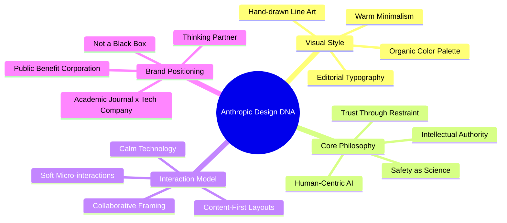

# Anthropic Design DNA

> Comprehensive analysis of Anthropic's website design language, visual style, and core design principles.
> 
> **Sources:** anthropic.com · claude.ai · docs.anthropic.com · Geist agency collaboration  
> **Date researched:** February 25, 2026

---

## Quick Reference

### Brand Identity

Anthropic's visual identity, developed with agency **Geist**, embodies *"Do the simple thing that works."* It positions Anthropic as a **public benefit corporation** rooted in trust, clarity, and intellectual rigor — more academic journal than Silicon Valley startup.

**Core pillars:**
- **Trust & Reliability** — "Paper and ink" aesthetic conveys control and deep thought
- **Human-Centric AI** — Serif fonts + hand-drawn illustrations = AI built *by* and *for* humans
- **Intellectual Minimalism** — Restrained, editorial, never flashy
- **Safety as Science** — Visual precision mirrors their methodical approach

---

## Color Palette

### Main Colors

| Role | Hex | Preview | Usage |
|------|-----|---------|-------|
| **Dark** | `#141413` |  | Primary text, dark backgrounds, footer |
| **Light / Cream** | `#faf9f5` |  | Primary background — signature "paper" feel |
| **Mid Gray** | `#b0aea5` |  | Secondary elements, metadata, borders |
| **Light Gray** | `#e8e6dc` |  | Card backgrounds, section dividers |

### Accent Colors

| Role | Hex | Preview | Usage |
|------|-----|---------|-------|
| **Terracotta** | `#d97757` |  | Primary accent — CTAs, decorative dots, brand warmth |
| **Dusty Blue** | `#6a9bcc` |  | Secondary accent — links, highlights |
| **Sage Green** | `#788c5d` |  | Tertiary accent — safety/growth connotations |

> Non-text shapes cycle through **orange → blue → green** to maintain visual interest. All accents are always muted, organic, and earthy — never saturated.

### CSS Variables (ready to use)

```css
:root {
  /* Main */
  --anthropic-dark: #141413;
  --anthropic-cream: #faf9f5;
  --anthropic-mid-gray: #b0aea5;
  --anthropic-light-gray: #e8e6dc;

  /* Accents */
  --anthropic-terracotta: #d97757;
  --anthropic-blue: #6a9bcc;
  --anthropic-sage: #788c5d;
}
```

---

## Typography

### Font Pairing

| Context | Font | Fallback | Role |
|---------|------|----------|------|
| **Headings** (≥24pt) | **Poppins** | Arial | Modern, geometric, clean authority |
| **Body text** | **Lora** | Georgia | Humanistic, readable, warmth |
| **Product UI / Code** | Sans-serif (Inter-like) | System | Technical, functional clarity |

### Typographic Hierarchy

| Element | Style |
|---------|-------|
| **Hero headlines** | Extremely large scale serif — dramatic contrast |
| **Section headlines** | Bold, generous letter-spacing |
| **Body copy** | ~16px, line-height ~1.6, well-spaced paragraphs |
| **Metadata/labels** | Small, gray, uppercase or lightweight — always secondary |

### CSS (ready to use)

```css
@import url('https://fonts.googleapis.com/css2?family=Poppins:wght@400;500;600;700&family=Lora:wght@400;500;600;700&display=swap');

:root {
  --font-heading: 'Poppins', Arial, sans-serif;
  --font-body: 'Lora', Georgia, serif;
}

h1, h2, h3, h4 {
  font-family: var(--font-heading);
}

body, p, li {
  font-family: var(--font-body);
  font-size: 16px;
  line-height: 1.6;
}
```

---

## Layout & Spatial Design

### Principles
- **Massive white space** — content "breathes" with generous padding/margins
- **No visual clutter** — sections are sparse, focused, intentional
- **Content-first hierarchy** — research and product are always the focal point

### Grid & Structure
- Clean **multi-column grid** for cards and feature sections
- **Full-width hero sections** with centered content
- **Modular card system** — slightly rounded corners, borderless or subtle-bordered
- Section separators = **background color shifts** (cream → beige → white), not hard borders

### Key Patterns
| Pattern | Usage |
|---------|-------|
| **Sticky floating cards** | Contextual messaging (e.g., "Claude is a space to think") |
| **Pill navigation** | Content categories (Write, Learn, Code, Research, Analyze, Create) |
| **Horizontal carousels** | Latest releases and news sections |
| **Background color shifts** | Section dividers — subtle, not hard-lined |

---

## Visual Elements

### Hand-Drawn Illustrations *(Signature Element)*
Anthropic's most distinctive brand marker:
- Organic, flowing **black brush strokes**
- Abstract representations of faces, hands, thought processes
- Paired with **terracotta dots/circles** as accents
- Conveys warmth, humanity, and approachability in a technical domain

### Photography
- **Conceptual/scientific** — Mars surfaces, organic textures, abstract patterns
- Never stock photos — always editorial or documentary in tone
- Nature and science themes over literal "robot/circuit" imagery

### Iconography
- **Thin line icons** — consistent monochrome stroke weight
- Matches the hand-drawn illustration style
- Used sparingly — only for clear wayfinding

---

## Buttons & Interactive Design

### Button Styles

| Type | Style | Example |
|------|-------|---------|
| **Primary** | Solid `#141413`, white text, rounded | "Try Claude" |
| **Accent** | Terracotta `#d97757` fill, white text, rounded | "Ask Claude ↑" |
| **Secondary** | Text-only with arrow (`→`) or underline | "Read More →" |
| **Outline** | Thin border, rounded, no fill | "macOS", "Windows" |

### Micro-Interactions
- **Soft hover states** — opacity shifts and subtle color transitions
- **Fluid scroll** — smooth, never snappy
- **No aggressive motion** — zero bouncing, flashing, or attention-grabbing animations
- Overall **"calm technology"** interaction philosophy

---

## Design Across Surfaces

| Surface | Characteristic |
|---------|---------------|
| **Marketing** (anthropic.com) | Premium editorial — large serif headlines, conceptual imagery, generous spacing |
| **Product** (anthropic.com/claude) | "Thinking partner" framing — warm, inviting, inline prompt input in hero |
| **Docs** (docs.anthropic.com) | Same palette, utilitarian layout — card navigation, AI-powered search |
| **App** (claude.ai) | Clean focused input, minimal chrome — the conversation IS the interface |

---

## Core Design Principles

| Principle | Visual Manifestation |
|-----------|---------------------|
| *"Do the simple thing that works"* | Minimalist layouts, restrained palette, no gratuitous decoration |
| *"Be helpful, honest, and harmless"* | Clear CTAs, transparent messaging, zero dark patterns |
| *"Hold light and shade"* | Warm cream + authoritative dark — simultaneously inviting and serious |
| *"Safety is a Science"* | Clinical precision in typography and spacing; methodical grids |
| *"AI Companies are One Piece"* | Humble, understated — never aggressive or attention-seeking |

### Design Manifesto (inferred)

> *"We are serious about what we're building, but we are also human. Our visual language is warm but precise, editorial but accessible, minimal but not cold. We want you to think with us, not be dazzled by us."*

---

## Design DNA Mindmap



---

## Visual References

All screenshots and recordings are in the `assets/` directory:

| File | Description |
|------|-------------|
| `claude_hero_section.png` | Claude product page hero with hand-drawn illustration |
| `claude_features.png` | Feature cards with line-art icons and modular layout |
| `claude_features_2.png` | Additional feature section with interactive tabs |
| `claude_footer.png` | Dark footer grounding the page |
| `docs_home.png` | Developer docs — brand palette in utilitarian layout |
| `homepage_browse.webp` | Full homepage browsing recording |
| `claude_page_browse.webp` | Claude product page deep-dive recording |
