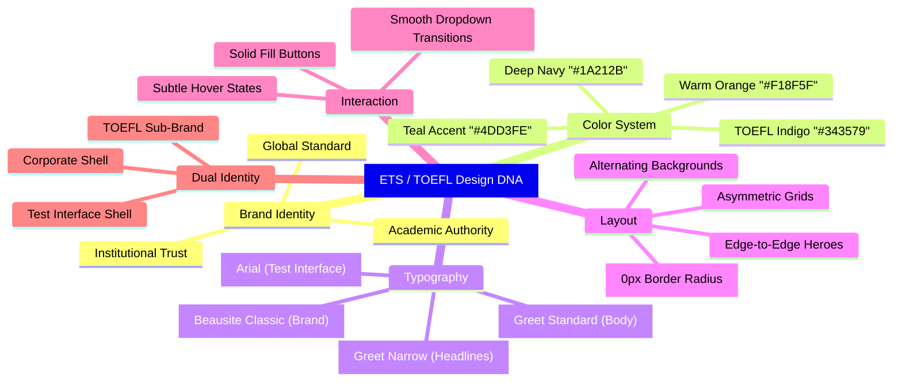
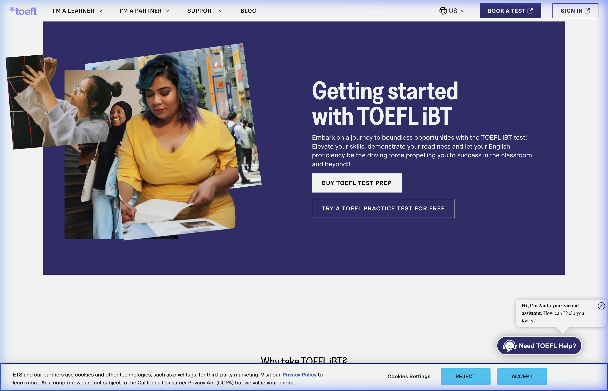
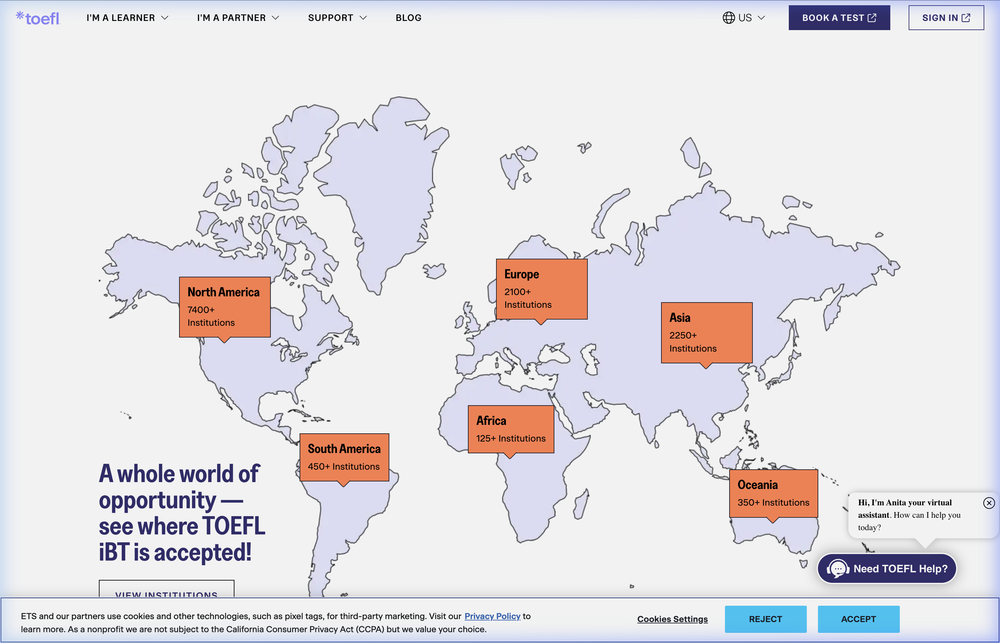
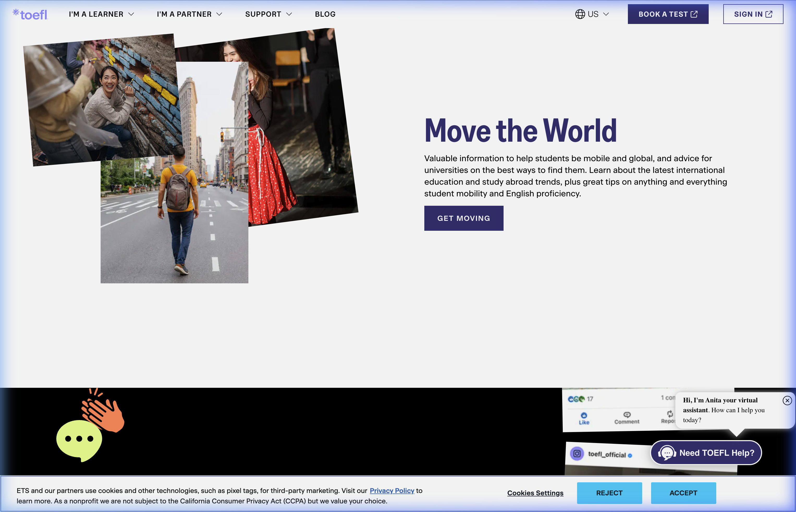
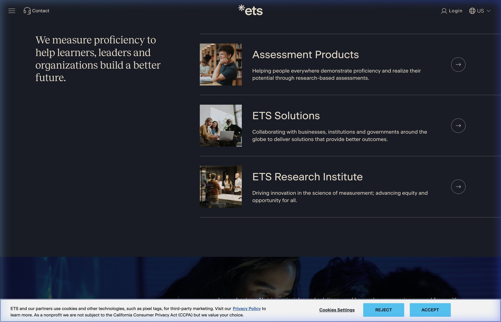

# 🎓 ETS / TOEFL iBT — Design DNA

> **Brand:** Educational Testing Service (ETS) | TOEFL iBT  
> **Source Sites:** [ets.org](https://www.ets.org), [ets.org/toefl](https://www.ets.org/toefl.html)  
> **Research Date:** February 25, 2026  
> **Status:** ✅ Complete

---

## Quick Reference

| Property | Value |
|---|---|
| **Brand Archetype** | "Academic Authority" — Corporate, Trustworthy, Modern, Authoritative |
| **Primary Color** | Deep Navy `#1A212B` |
| **Accent Color** | TOEFL Indigo `#343579` / Teal `#4DD3FE` |
| **Headline Font** | Beausite Classic (Brand) / Greet Narrow (Sub-brand) |
| **Body Font** | Greet Standard, fallback: `system-ui, sans-serif` |
| **Button Style** | Sharp corners (`border-radius: 0px`), solid fill |
| **Design Philosophy** | "Distraction-Free Authority" — Maximizing trust through institutional precision |

---

## 1. Brand Identity & Design Philosophy

ETS occupies a unique position in design: they must feel **simultaneously institutional and modern**. Their 2024–2026 rebrand successfully transitions from the dated 2010s-era ETS blue into a sophisticated, high-contrast design language that balances:

- **Academic credibility** (serif accents, navy palette, structured grids)  
- **Modern tech aesthetics** (generous whitespace, flat design, component architecture)  
- **Global accessibility** (WCAG 2.1 AA compliance, high-contrast ratios, system font fallbacks)

### Core Design Axioms

1. **Authority Through Restraint** — The palette is intentionally narrow (navy + white + one accent). Excess color signals informality.
2. **Zero Border Radius** — Every button, card, and container uses `0px` border-radius. This sharp-edged geometry creates a distinctly institutional feel.
3. **Typography as Hierarchy** — Three font tiers (Beausite > Greet Narrow > Greet Standard) encode visual importance without relying on color.
4. **Negative Space as Content** — Generous padding (often 80–120px between sections) gives the impression of premium, carefully curated information.

---

## 2. Color Palette

### Primary Colors

| Swatch | Name | Hex | RGB | Usage |
|---|---|---|---|---|
|  | **Deep Navy** | `#1A212B` | `rgb(26, 33, 43)` | Global nav bg, primary buttons, meta theme-color, primary headings |
|  | **TOEFL Indigo** | `#343579` | `rgb(52, 53, 121)` | TOEFL sub-brand accent, section backgrounds, sub-brand CTAs |
|  | **White** | `#FFFFFF` | `rgb(255, 255, 255)` | Header/footer bg, content containers, button text |

### Accent Colors

| Swatch | Name | Hex | RGB | Usage |
|---|---|---|---|---|
|  | **Teal Cyan** | `#4DD3FE` | `rgb(77, 211, 254)` | Corporate homepage CTAs, "Learn More" buttons |
|  | **Warm Orange** | `#F18F5F` | `rgb(241, 143, 95)` | Info markers, map highlights, data visualization accents |
|  | **Lavender Wash** | `#F5F6FF` | `rgb(245, 246, 255)` | Alternating section backgrounds, soft contrast blocks |

### Functional Colors

| Swatch | Name | Hex | RGB | Usage |
|---|---|---|---|---|
|  | **Off-Black** | `#212121` | `rgb(33, 33, 33)` | Primary text in reading passages (reduced eye strain) |
|  | **Slate Gray** | `#5E6A75` | `rgb(94, 106, 117)` | Secondary text, instructions, sub-labels |
|  | **Warm Cream** | `#F2E9D8` | `rgb(242, 233, 216)` | Off-white text on dark backgrounds |
|  | **Canvas Gray** | `#F4F5F7` | `rgb(244, 245, 247)` | App canvas / dead-space letterboxing |
|  | **Border Blue-Gray** | `#D1D6E0` | `rgb(209, 214, 224)` | Header/footer bottom borders |
|  | **True Black** | `#000000` | `rgb(0, 0, 0)` | Footer background |

### Test Interface-Specific Colors

| Swatch | Name | Hex | Usage |
|---|---|---|---|
|  | **ETS Primary Blue** | `#005587` | Test shell buttons, active states |
|  | **Alert Red** | `#D32F2F` | Timer ≤5min warning, disconnection alerts |
|  | **Disabled Button BG** | `#E5E7EB` | Disabled state background |
|  | **Disabled Text** | `#9CA3AF` | Disabled state text |
|  | **Highlight Yellow** | `#FFF2CC` | Text selection in Reading section |

### CSS Variable Snippet

```css
:root {
  /* ETS Corporate */
  --ets-navy: #1A212B;
  --ets-toefl-indigo: #343579;
  --ets-teal: #4DD3FE;
  --ets-orange: #F18F5F;
  --ets-lavender: #F5F6FF;
  
  /* Text */
  --ets-text-primary: #212121;
  --ets-text-secondary: #5E6A75;
  --ets-text-on-dark: #F2E9D8;
  
  /* Backgrounds */
  --ets-bg-canvas: #F4F5F7;
  --ets-bg-footer: #000000;
  --ets-border-soft: #D1D6E0;
  
  /* Test Shell (In-Test Environment) */
  --ets-primary-blue: #005587;
  --ets-alert-red: #D32F2F;
  --ets-disabled-bg: #E5E7EB;
  --ets-disabled-text: #9CA3AF;
  --ets-highlight: #FFF2CC;
}
```

---

## 3. Typography

ETS employs a **three-tier typographic hierarchy** using custom fonts that are not available via Google Fonts — they are self-hosted via the ETS CDN.

### Font Stack

| Tier | Font Family | Role | Fallback |
|---|---|---|---|
| **1 (Brand)** | **Beausite Classic** | Logo, global nav, H1 headings, primary buttons | `system-ui, sans-serif` |
| **2 (Sub-brand)** | **Greet Narrow** | H2–H3 headings, card titles, section headers | `system-ui, sans-serif` |
| **3 (Body)** | **Greet Standard** | Body text, paragraphs, form labels, nav links | `system-ui, sans-serif` |

> [!NOTE]
> **Beausite Classic** is a neo-grotesque sans-serif by Fatype with unusually high stroke contrast. This gives ETS headlines a subtle sophistication that standard sans-serifs like Inter or Helvetica cannot replicate.

### Type Scale

| Context | Font | Size | Weight | Line Height | Letter Spacing |
|---|---|---|---|---|---|
| **Corporate H1** | Beausite Classic (or Speckless serif) | 89px | 700 | 1.1 | Normal |
| **TOEFL Hero H1** | Greet Narrow | 64px | 700 | 1.15 | Normal |
| **Page H1** | Beausite Classic | 48px | 700 | 1.2 | Normal |
| **Section H3** | Greet Narrow | 20px | 600 | 1.4 | Normal |
| **Body Text** | Greet Standard | 14px | 400 | 1.5 | Normal |
| **Nav Links** | Greet Standard | 14.34px | 500 | 1.5 | Normal |
| **Button Labels** | Beausite Classic | 14px | 600 | 1.0 | 1.12px |

### Test Interface Typography (Secure Browser)

| Context | Font | Size | Weight | Line Height |
|---|---|---|---|---|
| **Reading Passages** | Arial, Helvetica, sans-serif | 16px | 400 | 1.65 |
| **Questions & Options** | Arial, Helvetica, sans-serif | 15px | 400 | 1.5 |
| **UI Controls** | Arial, Helvetica, sans-serif | 14px | 600 | 1.0 |

> [!IMPORTANT]
> The **test interface** uses a completely different font stack from the marketing website. ETS forces system sans-serif fonts (Arial/Helvetica) inside the secure browser to guarantee pixel-length parity across all test-taker screens with zero load latency.

---

## 4. Layout & Spatial Design

### Page Architecture

```
┌──────────────────────────────────────────────────┐
│  GLOBAL NAV (height: ~60px, bg: #1A212B)         │
│  Logo | Products ▾ | Tests ▾ | Research | CTA    │
├──────────────────────────────────────────────────┤
│  SUB-NAV (height: ~50px, bg: #FFFFFF)            │
│  TOEFL Brand Nav | About | Prepare | Register    │
├──────────────────────────────────────────────────┤
│                                                  │
│  HERO SECTION                                    │
│  Full-width, lifestyle photography               │
│  Overlapping text + floating info cards           │
│  Padding: 80–120px vertical                      │
│                                                  │
├──────────────────────────────────────────────────┤
│  CONTENT SECTIONS                                │
│  Alternating white / lavender (#F5F6FF) blocks   │
│  Card-based layouts (borderless, no radius)       │
│  Max-width container: ~1200px, centered          │
│                                                  │
├──────────────────────────────────────────────────┤
│  FOOTER (bg: #000000)                            │
│  Multi-column layout: Products | Resources | Co. │
│  Social icons | Legal | Copyright                │
└──────────────────────────────────────────────────┘
```

### Spacing System

| Token | Value | Usage |
|---|---|---|
| **Section Padding** | 80–120px | Vertical padding between major content blocks |
| **Card Gap** | 24–32px | Space between grid cards |
| **Container Max-Width** | ~1200px | Centered content wrapper |
| **Nav Height (Global)** | ~60px | Persistent top header |
| **Nav Height (Sub-brand)** | ~50px | TOEFL-specific sub-navigation |

### Key Layout Patterns

1. **Asymmetric Two-Column** — Images intentionally overlap color-block backgrounds, breaking the grid line for visual interest
2. **Edge-to-Edge Hero** — Hero sections span full viewport width with no side padding
3. **Floating Info Cards** — Cards positioned to partially overlap hero imagery, creating depth
4. **Alternating Backgrounds** — Sections alternate between `#FFFFFF` and `#F5F6FF` to provide natural visual rhythm

---

## 5. Interactive Design

### Button System

| Variant | Background | Text Color | Border | Border Radius | Font | Weight | Tracking |
|---|---|---|---|---|---|---|---|
| **Primary** | `#1A212B` | `#FFFFFF` | None | `0px` | Beausite Classic | 600 | 1.12px |
| **Primary (TOEFL)** | `#343579` | `#FFFFFF` | None | `0px` | Beausite Classic | 600 | 1.12px |
| **Primary (Corporate)** | `#4DD3FE` | `#1A212B` | None | `0px` | Beausite Classic | 600 | 1.12px |
| **Secondary (Ghost)** | Transparent | `#1A212B` | 1px solid | `0px` | Beausite Classic | 600 | 1.12px |
| **Disabled** | `#E5E7EB` | `#9CA3AF` | None | `0px` | — | — | — |

> [!TIP]
> The consistent `0px` border-radius across ALL interactive elements is a deliberate ETS design decision. It communicates institutional seriousness — rounded buttons feel "friendly" and "startup-like," which contradicts ETS's positioning as a high-stakes testing authority.

### Hover & Interaction States

- **Buttons**: Subtle background color shift (typically 10–15% lighter/darker) or opacity reduction
- **Nav Links**: Underline appears on hover with smooth transition
- **Cards**: No visible hover state change — reinforces the "static document" feel
- **Dropdown Menus**: Smooth slide-down transition (~200ms ease)

---

## 6. Navigation Architecture

### Global Navigation (Corporate)

- **Background**: `#1A212B` (Deep Navy)
- **Height**: ~60px
- **Layout**: Flexbox — Logo (left) | Menu items (center-left) | CTA button (right)
- **Font**: Beausite Classic, 14px, weight 500
- **Active Indicator**: Subtle underline or bold weight shift

### Sub-Brand Navigation (TOEFL)

- **Background**: `#FFFFFF`
- **Height**: ~50px
- **Separator**: 1px bottom border `#D1D6E0`
- **Layout**: TOEFL logo (left) | Section links (center) | Registration CTA (right)
- **Purpose**: Contextualizes the user within the TOEFL product ecosystem

### Footer

- **Background**: `#000000` (True Black)
- **Layout**: Multi-column grid (4+ columns)
- **Content**: Product links, resource links, corporate info, social icons, legal
- **Typography**: Light weight, small size (~12–13px), white text

---

## 7. Visual Elements

### Photography Style

- **Subjects**: Diverse, candid, high-quality lifestyle shots of students and professionals
- **Treatment**: Sharp edges (no rounded corners on images), sometimes tilted 2–5° for dynamism
- **Composition**: Often deliberately overlap background color blocks or break grid boundaries
- **Tone**: Warm, aspirational, globally inclusive

### Iconography

- **Style**: Thin-line, monochrome, minimal
- **Weight**: 1–2px stroke
- **Usage**: Sparse — icons supplement text rather than replace it
- **Examples**: Arrow-in-circle for navigation, thin chevrons for dropdowns

### Graphic Elements

- **Maps**: Stylized, simplified world maps in lavender tones showing TOEFL acceptance
- **Data Viz**: Orange (`#F18F5F`) accents for highlighting key statistics
- **Dividers**: Clean 1px lines in `#D1D6E0`, never thick or decorative

---

## 8. Core Design Principles

| # | Principle | Description | Visual Manifestation |
|---|---|---|---|
| 1 | **Institutional Trust** | Design communicates "we are the global standard" | Navy palette, sharp corners, serif accents |
| 2 | **Distraction-Free Focus** | Nothing competes for attention on any screen | Generous whitespace, minimal iconography, muted accents |
| 3 | **Global Accessibility** | Serves 200+ countries, all screen sizes | WCAG AA, system font fallbacks, high contrast ratios |
| 4 | **Dual Identity** | Corporate ETS vs. product TOEFL live in the same shell | Two-tier nav, color accent shifts, font-tier encoding |
| 5 | **Precision Over Personality** | The brand is serious; the design reflects that | 0px radii, tracked-out button text, no playful elements |

---

## 9. Design DNA Mindmap



---

## 10. Visual Reference Gallery

### TOEFL Homepage — Content Sections


### TOEFL Homepage — Footer Area


### TOEFL Homepage — Bottom Footer


### ETS Corporate Homepage — Content


### Full Browsing Recordings

- [ETS Visual Reconnaissance Recording](assets/ets_visual_recon_1772010702834.webp) — Full scroll-through of ets.org/toefl and ets.org
- [ETS Deeper CSS Analysis Recording](assets/ets_deeper_analysis_1772011254770.webp) — CSS extraction from About and Prepare pages

---

*Research conducted using browser-based visual reconnaissance, JavaScript CSS extraction, and web research.*
