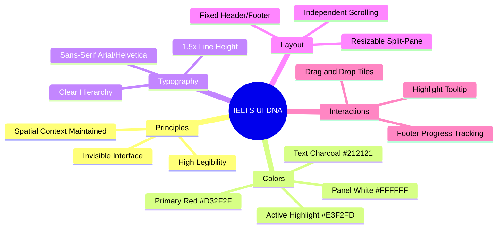

# IELTS Computer-Delivered Test UI Design DNA

## Quick Reference

The IELTS Computer-Delivered Test UI is designed with a singular focus on **legibility, accessibility, and minimal distraction**. It utilizes a strict split-pane layout to simultaneously present long-form reading passages and corresponding questions. The visual identity relies heavily on high-contrast, neutral backgrounds (white and light grey) punctuated by specific, purposeful splashes of the brand's primary red and functional status colors (green for success, light blue for active selection).

## Core Design Principles

*   **Invisible Interface:** The UI should recede into the background, ensuring the candidate's cognitive load is entirely dedicated to the test content, not navigating the software.
*   **High Contrast & Legibility:** typography choices and stark background contrasts ensure maximum readability over extended periods (up to 3 hours).
*   **Spatial Integrity:** The split-screen design ensures candidates never lose the context of the reading passage while interacting with questions.
*   **Clear State Communication:** Strong, unambiguous visual cues (like bold borders or solid highlights) convey current position, answered vs. unanswered status, and remaining time.

## Color Palette

| Role | Color | Hex | Notes |
| :--- | :--- | :--- | :--- |
| **Primary Brand** | Red | `#D32F2F` | Used for the main IELTS logo and critical warnings. |
| **Main Background** | Light Grey | `#F4F4F4` | The window canvas background. |
| **Panel Background** | Pure White | `#FFFFFF` | Background for reading passages and question areas. |
| **Primary Text** | Charcoal | `#212121` | Maximum readable contrast without the harshness of `#000000`. |
| **Secondary Text** | Slate | `#555555` | Used for sub-headings, minor labels. |
| **Action** | Black | `#000000` | Primary action buttons text or background depending on state. |
| **Active/Selected** | Light Blue | `#E3F2FD` | Highlights the currently active question number or selected tiles. |
| **Success/Done** | Emerald | `#2E7D32` | Indicates completed tasks or correct states in tutorials. |

```css
:root {
  --ielts-ui-primary-red: #D32F2F;
  --ielts-ui-bg-main: #F4F4F4;
  --ielts-ui-bg-panel: #FFFFFF;
  --ielts-ui-text-primary: #212121;
  --ielts-ui-text-secondary: #555555;
  --ielts-ui-action-black: #000000;
  --ielts-ui-active-blue: #E3F2FD;
  --ielts-ui-success-green: #2E7D32;
}
```

## Typography

The interface employs a clean, ubiquitous **sans-serif** typeface (like Arial, Helvetica, or a similarly neutral system font) to prioritize function over character.

*   **Primary Font Family:** `Arial, Helvetica, sans-serif`
*   **Titles & Main Headings:** ~20px - 24px, Bold. Used sparingly for main sections.
*   **Passage Headers:** ~18px, Bold.
*   **Body Text (Reading Passages):** ~14px - 16px, Regular weight, with a generous `line-height` of ~1.5 to prevent eye fatigue during dense reading blocks.
*   **UI Labels / Information:** ~12px - 13px, Medium or Bold. Used for candidate details, timers, and button text.

```css
/* Typography Snippets */
.ielts-ui-body {
  font-family: Arial, Helvetica, sans-serif;
  font-size: 16px;
  line-height: 1.5;
  color: var(--ielts-ui-text-primary);
}

.ielts-ui-title {
  font-family: Arial, Helvetica, sans-serif;
  font-size: 24px;
  font-weight: 700;
  color: var(--ielts-ui-text-primary);
}
```

## Layout & Visual Elements

The fundamental structure is a rigid, fixed-frame layout containing a resizable workspace.

1.  **Fixed Header Bar:**
    *   **Left:** Branding (Logo) + Candidate Information.
    *   **Center:** Persistent Test Timer.
    *   **Right:** Global controls (Volume, Settings icon, Network status).
2.  **Split-Pane Workspace (The Core Layout):**
    *   **Left Pane:** Dedicated exclusively to the source material (Reading passage). Scrollable independently.
    *   **Right Pane:** Dedicated to the interactive item (Questions). Scrollable independently.
    *   **Splitter:** A draggable vertical divider allowing the candidate to adjust the ratio of passage-to-questions horizontally.
3.  **Fixed Footer Navigation:**
    *   A dense ribbon displaying the entire test structure (e.g., Parts 1-3).
    *   A grid of question numbers. Answered questions format differently (e.g., underlined or filled) from unanswered. The current question is highlighted with a blue box.

## Interaction Design

*   **Buttons:** Sharp, utilitarian. Action buttons often feature stark black backgrounds with white text. Navigation uses functional arrows.
*   **Select-to-Highlight:** Dragging text in the reading passage summons a context menu with options to 'Highlight' (yellow marker) or add a 'Note'.
*   **Drag-and-Drop (Matching):** Draggable elements (like headings) have a subtle border and drop shadow on interaction. Drop zones are clearly delineated containers.
*   **Inline Editing (Gap Fill):** Text input boxes are embedded directly into sentences, matching the baseline of the surrounding text.

## Listening Interface

*   **Audio Status Strip:** The bottom grey navigation bar includes an embedded "Listening to the recordings..." status, distinguishing the active audio state.
*   **Global Controls:** A dedicated volume control icon sits alongside the network and settings icons in the bottom right corner of the fixed footer.
*   **Gap Fill (Inline):** Text input boxes are integrated directly into sentences or tables, utilizing a simple solid border that sits neatly on the baseline.
*   **Multiple Choice:** Standard circular radio buttons align vertically with the answer options, presenting a clean hierarchy separate from the main question block.

## Writing Interface

*   **Split-Screen Task View:** The layout rigidly divides the question prompt (left pane) and the text editor (right pane), separated by a draggable vertical divider to adjust panel proportions.
*   **Text Editor Design:** An unembellished white text area with a subtle grey border. It intentionally lacks a rich-text toolbar to ensure the focus remains strictly on plain text entry.
*   **Word Count:** A persistent, low-profile text indicator (e.g., "Words: 155") is anchored just below the bottom-right corner of the editable text area.
*   **Urgent Timer Affordance:** The top navigation header shifts its background color from white to brand red (`#D32F2F`) as the time limit enters critical final minutes, maintaining high contrast with white text.

## Design DNA Mindmap



---

## Inspera IELTS Demo — Live Platform Analysis

> *Source: hands-on exploration of the Inspera-delivered IELTS Reading demo at `inspera.com/ielts-demo`. All observations below were captured directly from the live platform.*

### Platform Overview

The Inspera-delivered IELTS Reading test uses a **fixed-frame, split-pane architecture** rendered as a full-viewport web application. The interface is intentionally austere — every pixel serves legibility or navigation, with zero decorative elements.

### Header Bar (Fixed, ~50px)

| Zone | Content | Notes |
| :--- | :--- | :--- |
| **Far Left** | IELTS logo (red on white) | Brand anchor, non-interactive |
| **Center-Left** | `Test taker ID` label | Plain text, `Arial`, ~14px, `#333` |
| **Right Cluster** | WiFi icon · Bell icon · Hamburger (☰) | Spaced ~24px apart; all are interactive |

*   The **WiFi icon** indicates network connectivity status (always visible).
*   The **Bell icon** opens a **Notifications panel** — a slide-down overlay listing system messages. In demo mode the panel is empty.
*   The **Hamburger icon (☰)** opens the **Options overlay** — a full-screen modal containing:
    *   **"Go to submission page"** — red button (`#C62828` background, white text), prominent CTA with right-chevron.
    *   **"Contrast"** — toggles high-contrast mode (half-moon icon), with right-chevron submenu.
    *   **"Text size"** — adjusts font scaling (magnifier icon), with right-chevron submenu.
    *   Close button **✕** in the top-right corner of the modal.

### Instruction Bar (~56px, below header)

A light grey bar (`#EEEEEE` background, `1px` bottom border) displaying:
*   **Part label** — Bold, e.g. `Part 2` in `~14px` bold.
*   **Instruction text** — Regular weight, e.g. `Read the text and answer questions 14–26.`

### Split-Pane Content Area

The main workspace occupies the remaining viewport between header/instruction bar and footer.

| Property | Value |
| :--- | :--- |
| **Default Ratio** | ~50/50 passage-to-questions |
| **Resizer Handle** | `↔` (double-arrow) centered vertically on a thin (~4px) divider |
| **Passage Background** | `#FFFFFF` (pure white) |
| **Questions Background** | `#FFFFFF` (pure white) |
| **Independent Scrolling** | Yes — each pane scrolls independently |

**Resizer Behavior:**
*   Dragging left expands the question pane; passage text wraps/truncates.
*   Dragging right expands the passage pane; question panel compresses.
*   No minimum-width constraint enforced in the demo (panes can be squeezed to ~20% width).

### Footer Navigation Bar (Fixed, ~44px)

A dense navigation ribbon anchored to the bottom of the viewport.

| Zone | Content | Format |
| :--- | :--- | :--- |
| **Left** | `Part 1  X of 13` | Part label + answered count |
| **Center** | `Part 2  [14] 15 16 17 18–19 20–21 22–23 24 25 26` | Active question boxed `[14]`, grouped questions use en-dash |
| **Right** | `Part 3  0 of 14` | Part label + answered count |

*   **Active question** is enclosed in a **1px solid dark border box** (e.g. `[14]`).
*   **Answered questions** display differently from unanswered (filled/underlined).
*   **Part tabs** are always visible — clicking directly jumps to that section.
*   **Previous/Next arrows** ( `←` `→` ) appear as dark rounded-rectangle buttons (~48×48px) in the bottom-right corner.
*   A **checkmark button** (✓) appears below the nav arrows — this triggers the "Review your answers" submission flow.

### Help / Keyboard Panel

Clicking the **keyboard icon** (⌨️ + "Help") above the passage reveals an inline tip bar:
*   Text: *"Use TAB to navigate between the draggable elements. The active element can be moved between open gaps using the arrow keys. Your answer is saved continuously."*
*   The Help toggle is borderless by default; when active it gains a **1px solid dark border** and appears "pressed."

### Comprehensive Question Type Taxonomy (Verified from Official Inspera Demos)

> *Source: All 10 official sample question demos from [ielts.org/academic-test](https://ielts.org/take-a-test/preparation-resources/sample-test-questions/academic-test), accessed 2026-02-25.*

---

#### 1. Multiple Choice — Single Answer

*   **Instruction Format:** "Questions 1–4. **Choose the correct answer.**"
*   **Layout:** Each question displays a numbered statement followed by 4 vertically stacked options with **circular radio buttons**.
*   **Radio Button Style:**
    *   Default: ~13px circle, `1px solid #999` border, empty center.
    *   Selected: Blue fill (`#418FC6`) with white inner dot. The **entire row** gains a light blue background (`rgb(187, 216, 240)`).
*   **Active Question Indicator:** The question number is enclosed in a square with `2px solid #418EC8` border.
*   **⚠️ Deselection (Inspera demo): NOT POSSIBLE.** Clicking an already-selected option does nothing in the demo. However, the **real CD-IELTS test DOES support deselection** (confirmed via official walkthrough video). Implement with deselection enabled.
*   **Footer State:** Answered questions show a small **green horizontal bar** above the question number.

#### 2. Multiple Choice — Pick TWO (or more)

*   **Instruction Format:** "Choose **TWO** correct answers." (Number is bolded and all-caps.)
*   **Input Type:** Square **checkboxes** (~18×18px) replace radio buttons.
*   **Checkbox Style:**
    *   Default: Square box, `1px solid #999` border.
    *   Selected: Blue fill (`#418FC6`) with white checkmark (✓). Row gains light blue background.
*   **Selection Limit Enforcement:** The interface **strictly prevents** selecting more than the required number. Clicking a 3rd checkbox when the limit is 2 has **no effect** — no error message, no toggle.
*   **✅ Deselection: SUPPORTED.** Clicking a selected checkbox deselects it.
*   **Footer Grouping:** Questions are displayed as en-dash pairs (e.g., `1–2`, `3–4`). Status shows "Attempted" **only when the exact required count** is selected (e.g., 2 of 2).

#### 3. True / False / Not Given (Identifying Information)

*   **Instruction Format:** "Choose **TRUE** if the statement agrees with the information... choose **FALSE** if the statement contradicts... or choose **NOT GIVEN** if there is no information on this."
*   **Keywords:** TRUE, FALSE, NOT GIVEN displayed in **all-caps bold** in the instruction.
*   **Option Layout:** Three vertically stacked radio buttons labeled `TRUE`, `FALSE`, `NOT GIVEN`.
*   **Selection Feedback:** Entire row highlighted with light blue background (`rgb(186, 212, 235)`). Radio button filled with blue dot.
*   **⚠️ Deselection (Inspera demo): NOT POSSIBLE** in the demo, but the **real test DOES support it**. Implement with deselection enabled.
*   **CSS:** Radio `appearance: auto`, ~13×13px. Labels use `Arial, sans-serif`, `16px`, `padding-left: 32px`.

#### 4. Note Completion (Text Input)

*   **Instruction Format:** "Complete the notes. Write **ONE WORD ONLY** from the text for each answer."
*   **Display:** Structured notes presented as bullet points with inline `<input>` gaps within sentences.
*   **Input Field Style:**
    *   Width: `144px`, Height: ~`22.4px`.
    *   Border: `1px solid rgb(83, 83, 83)` (dark grey).
    *   Border Radius: `3px`.
    *   Font: `16px Arial`, color `#000000`, padding `0 8px`.
    *   Placeholder: Question number (e.g., "1", "2") centered in grey.
*   **Focus State:**
    *   Border: `1px solid rgb(65, 142, 200)` (medium blue).
    *   Box Shadow: `rgb(65, 142, 200) 0px 0px 0px 1px` — creates a blue "glow" double-border effect.
*   **Footer:** Updates to "Attempted" immediately when any text is typed.

#### 5. Table Completion (Text Input)

*   **Instruction Format:** "Write **NO MORE THAN THREE WORDS** from the text for each answer." (limit varies)
*   **Display:** A standard HTML `<table>` with `border-collapse: collapse`, `1px solid black` borders on all cells.
*   **Input Gaps:** Placed directly **inside table cells**. Cell padding: `4.8px` vertical, `8px` horizontal.
*   **Input Field Style:** Identical to Note Completion inputs — `126–144px` wide, `3px` border-radius, blue focus border + box-shadow.
*   **Table Headers:** First row/column serve as headers. Font size `16px Arial`.

#### 6. Sentence Completion (Text Input)

*   **Instruction Format:** "Complete the sentences. Write **ONE WORD ONLY** from the text for each answer."
*   **Display:** Numbered sentences displayed sequentially, each with an inline `<input>` gap at the end or within the sentence.
*   **Input Field Style:** Identical to Note Completion — `144px` width, `3px` border-radius, grey border, blue focus state with box-shadow.
*   **Identical interaction** to Note Completion — type answer, footer updates immediately.

#### 7. Matching Features (Radio-Button Matrix)

*   **Instruction Format:** "Choose the correct group, **A–E**, for each item. You may choose any group more than once."
*   **Display:** A **grid/matrix** where rows are numbered items (e.g., "1 — black powder") and columns are lettered groups (A, B, C, D, E).
*   **Below the grid,** a legend table maps letters to full descriptions (e.g., "A — the Chinese").
*   **Interaction:** Click the **intersecting cell** to assign a group to an item. Uses circular radio buttons within each cell.
*   **Row Constraint:** One selection per row (radio behavior — clicking another cell in the same row replaces the previous).
*   **Column Constraint:** Same column CAN be selected for multiple rows (per "more than once" instruction).
*   **⚠️ Deselection (Inspera demo): NOT POSSIBLE** in the demo, but the **real test DOES support it**. Implement with deselection enabled.
*   **Hover Effect:** Light grey background on interactive cells.
*   **Selection Visual:** Blue radio dot + **entire cell** turns light blue.

#### 8. Summary Completion — From Text (Text Input)

*   **Instruction Format:** "Complete the summary. Write **NO MORE THAN TWO WORDS** from the text for each answer."
*   **Display:** Summary paragraph(s) with inline `<input>` gaps embedded in the text flow.
*   **Input Field Style:** Identical to Note Completion inputs — `144px` width, blue border (`#418EC8`), box-shadow glow on focus.
*   **No word bank.** Words must be manually typed from the passage.

#### 9. Summary Completion — From a List (Drag-and-Drop Word Bank)

*   **Instruction Format:** "Complete the summary using the list of words. Choose the correct answer and **move it into the gap.**"
*   **Display:** Summary paragraph(s) with **dashed-border drop zones** embedded inline, plus a **horizontal word bank** at the bottom of the question pane.
*   **Word Bank Pills:**
    *   White background, `1px solid #0E98F0` (bright blue) border, `4px` border-radius.
    *   Blue text. Cursor: `move` on hover.
    *   Arranged horizontally in a flex-row container.
*   **Drop Zones (Empty):**
    *   `1px dashed rgba(197, 197, 197, 0.75)` (grey), `5px` border-radius.
    *   Contains centered question number (e.g., "1", "2").
*   **Drop Zones (Populated):** Receives a `populated` class; the pill docks inside, replacing the number.
*   **Mechanics:**
    *   **Single-use:** Words are **moved** from the bank, not copied. Once placed, they disappear from the bank.
    *   **Replacement:** Dragging a new word into an occupied gap **replaces** the existing word, which returns to the bank.
    *   **Help Button:** ⌨️ "Help" — tooltip: *"Use TAB to navigate between the draggable elements..."*

#### 10. Matching Sentence Endings (Drag-and-Drop)

*   **Instruction Format:** "Complete each sentence with the correct ending. Choose the correct answer and **move it into the gap.**"
*   **Display:** Numbered sentence stems (e.g., "1. Harkness's research method was different...") each followed by a wide **dashed-border drop zone**.
*   **Sentence Ending Bank:** Listed vertically below the questions as draggable pills.
*   **Drop Zone Style:**
    *   Empty: `1px dashed #C5C5C5` (grey), `5px` border-radius, height `27px`, width `~492px`.
    *   Active/Focused: `2px dashed #418EC8` (blue) — highlights when being dragged over.
*   **Choice Pill Style:** `1px solid #C5C5C5` (grey), `4px` border-radius, height `27px`, variable width.
*   **Mechanics:** Identical to Summary Completion from list — move (not copy), replacement on occupied gaps.
*   **More distractors than gaps** (e.g., 6 pills for 3 gaps).

---

### Interaction Behavior Summary Table

| Question Type | Input Mechanism | Deselectable? | Footer State Trigger |
| :--- | :--- | :--- | :--- |
| MCQ Single | Radio button | ✅ Yes (real test) / ❌ No (Inspera demo) | Any selection → green bar |
| MCQ Multi (Pick TWO) | Checkbox | ✅ Yes | Exact count met → "Attempted" |
| T/F/NG | Radio button | ✅ Yes (real test) / ❌ No (Inspera demo) | Any selection → green bar |
| Note Completion | Text `<input>` | N/A | Any keystroke → "Attempted" |
| Table Completion | Text `<input>` in table cell | N/A | Any keystroke → "Attempted" |
| Sentence Completion | Text `<input>` | N/A | Any keystroke → "Attempted" |
| Matching Features | Radio matrix (grid) | ✅ Yes (real test) / ❌ No (Inspera demo) | Any cell click → green bar |
| Summary (from text) | Text `<input>` | N/A | Any keystroke → "Attempted" |
| Summary (from list) | Drag-and-drop pills | ✅ (drag out) | Pill placed → "Attempted" |
| Sentence Endings | Drag-and-drop pills | ✅ (drag out) | Pill placed → "Attempted" |

### Text Selection & Highlighting

When text is **selected** (click-drag) in the passage pane, a **context menu** appears near the selection:
*   The context menu offers **"Highlight"** (adds a yellow background marker to the selected text).
*   **Right-clicking** on existing highlighted text or selected text surfaces the same context menu.
*   No "Add note" option was observed in the demo (may be disabled or version-specific).

### Color Palette (Inspera Platform — Verified)

| Role | Hex | Sample |
| :--- | :--- | :--- |
| **Header Background** | `#333333` | Dark charcoal |
| **Instruction Bar BG** | `#EEEEEE` | Light grey |
| **Panel Background** | `#FFFFFF` | Pure white |
| **Primary Text** | `#333333` | Dark grey (not pure black) |
| **Active/Focus Blue** | `#418FC6` | Radio fills, focus rings, drop zones |
| **Submission Red** | `#C62828` | "Go to submission page" button |
| **IELTS Logo Red** | `#D32F2F` | Brand red in header |
| **Border Default** | `#CCCCCC` | Input borders, dividers |
| **Border Dark** | `#333333` | Drag labels, active Q box |

### Typography (Inspera Platform — Verified)

*   **Font Family:** `Arial, sans-serif` — no web fonts loaded.
*   **Passage Title:** ~18px, *italic*, Bold — e.g. *"The Physics of Traffic Behavior"*
*   **Passage Body:** ~15px, Regular, `line-height: 1.6`.
*   **Section Sub-headings:** ~15px, Bold — e.g. **"Dramatic effects can result from small changes in traffic just as in nature"**
*   **Question Headers:** ~15px, Bold — e.g. `Questions 14–17`.
*   **UI Labels:** ~13px, Regular — footer part counts, header text.

---

## Visual Reference Gallery

### Tutorial Walkthrough Screenshots
*   **Entry Dashboard:** `assets/entry_dashboard_ui_1772027168884.png`
*   **Multiple Choice View:** `assets/multiple_choice_ui_1772027148345.png`
*   **Split Screen & Passage:** `assets/split_screen_ui_1772027113821.png`
*   **Matching Headings UI:** `assets/matching_headings_ui_1772027157628.png`
*   **Contextual Tooltip (Instructions):** `assets/scroll_instructions_ui_1772027129976.png`
*   **Final Screen / Review:** `assets/final_screen_ui_1772027190776.png`
*   **Pre-test Checks:** `assets/pre_test_checks_ui_1772027179404.png`
*   **Walkthrough Recording:** `assets/test_ui_analysis_1772027077968.webp`

### Listening Interface Screenshots
*   **Listening Dashboard:** `assets/ielts_listening_dashboard_1772028143402.png`
*   **Listening Volume Check:** `assets/ielts_listening_volume_check_1772028158990.png`
*   **Listening Gap Fill:** `assets/ielts_listening_fill_blanks_ui_1772028176532.png`
*   **Listening Multiple Choice:** `assets/ielts_listening_multiple_choice_ui_1772028192072.png`
*   **Listening Matching:** `assets/ielts_listening_matching_ui_1772028208694.png`
*   **Listening Map Labelling:** `assets/ielts_listening_map_labelling_ui_1772028227758.png`

### Writing Interface Screenshots
*   **Writing Split Screen Overview:** `assets/ielts_writing_split_screen_overview_1772028333650.png`
*   **Writing Resizable Interface:** `assets/ielts_writing_resizable_interface_1772028347849.png`
*   **Writing Text Editor & Word Count:** `assets/ielts_writing_text_editor_and_word_count_1772028360554.png`
*   **Writing Timer Alert (Red):** `assets/ielts_writing_timer_alert_red_1772028378220.png`

### Inspera Reading Demo Screenshots
*   **Demo Initial Load (Part 1):** `assets/ielts_demo_initial_load_1772029403240.png`
*   **T/F/NG Question (Q1):** `assets/ielts_reading_question_1_1772029421863.png`
*   **Gap Fill Question (Q7):** `assets/ielts_reading_question_7_gap_fill_1772029431024.png`
*   **Part 2 Initial View:** `assets/ielts_reading_part_2_initial_1772029441319.png`
*   **Part 3 Initial View:** `assets/ielts_reading_part_3_initial_1772029467668.png`
*   **MCQ Layout:** `assets/ielts_reading_mcq_layout_1772029478150.png`
*   **Heading Matching (Drag-Drop):** `assets/ielts_reading_part_2_q14_matching_1772029490727.png`
*   **Text Selection Context Menu:** `assets/ielts_text_selection_menu_1772029625090.png`
*   **Right-Click Context Menu:** `assets/ielts_right_click_menu_1772029688140.png`
*   **Help / Keyboard Panel:** `assets/ielts_help_panel_1772029714492.png`
*   **Options Menu (Hamburger):** `assets/ielts_options_menu_dropdown_1772029725997.png`
*   **Notifications Panel:** `assets/ielts_notifications_panel_1772029743765.png`
*   **Drag State:** `assets/ielts_drag_state_1772029794459.png`
*   **Drop Zone Highlight:** `assets/ielts_drop_zone_highlight_1772029795182.png`
*   **Item Dropped State:** `assets/ielts_item_dropped_state_1772029795827.png`
*   **Resizer — Expanded Questions:** `assets/ielts_resizer_left_expanded_questions_1772029808605.png`
*   **Resizer — Expanded Passage:** `assets/ielts_resizer_right_expanded_passage_1772029811875.png`
*   **Radio Button Selected:** `assets/ielts_radio_button_selected_state_1772029838334.png`
*   **Gap Fill Input Active:** `assets/ielts_gap_fill_input_state_1772029841801.png`
*   **Checkbox Selected States:** `assets/ielts_checkbox_selected_states_1772029870300.png`
*   **Passage Scrolled Content:** `assets/ielts_passage_scrolled_content_1772029880869.png`

### Official Question Type Demo Screenshots (10 Types)
*   **MCQ Single Answer (Selected):** `assets/ielts_mcq_single_selected.png`
*   **MCQ Multi-Select (2 Selected):** `assets/ielts_mcq_multi_selected.png`
*   **T/F/NG (Selected):** `assets/ielts_tfng_selected.png`
*   **Note Completion (Interface):** `assets/ielts_note_completion.png`
*   **Table Completion (Interface):** `assets/ielts_table_completion.png`
*   **Matching Features Matrix (Initial):** `assets/ielts_matching_features_matrix.png`
*   **Matching Features Matrix (Filled):** `assets/ielts_matching_features_filled.png`
*   **Summary Completion from Text:** `assets/ielts_summary_completion_text.png`
*   **Summary Completion from List (DnD):** `assets/ielts_summary_completion_dnd.png`
*   **Matching Sentence Endings (DnD):** `assets/ielts_sentence_endings_dnd.png`


