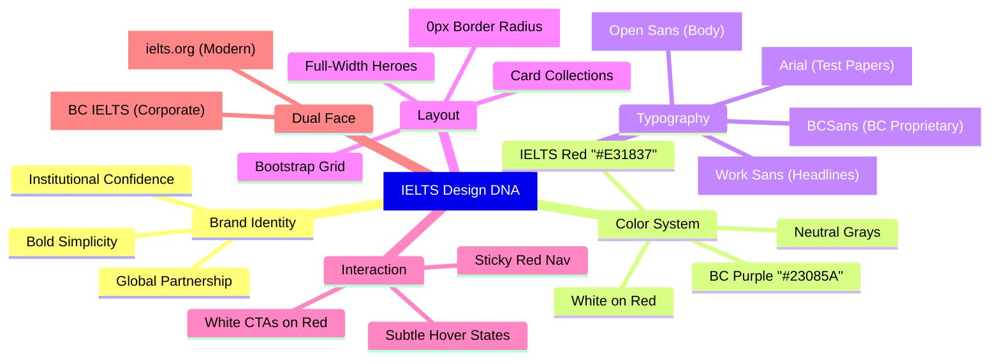
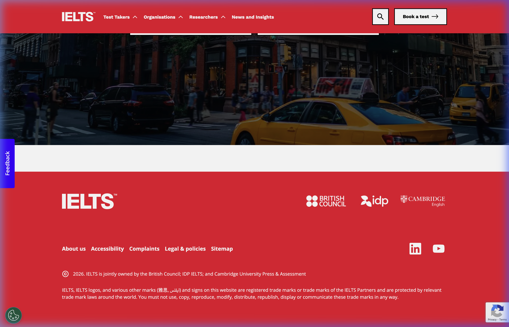
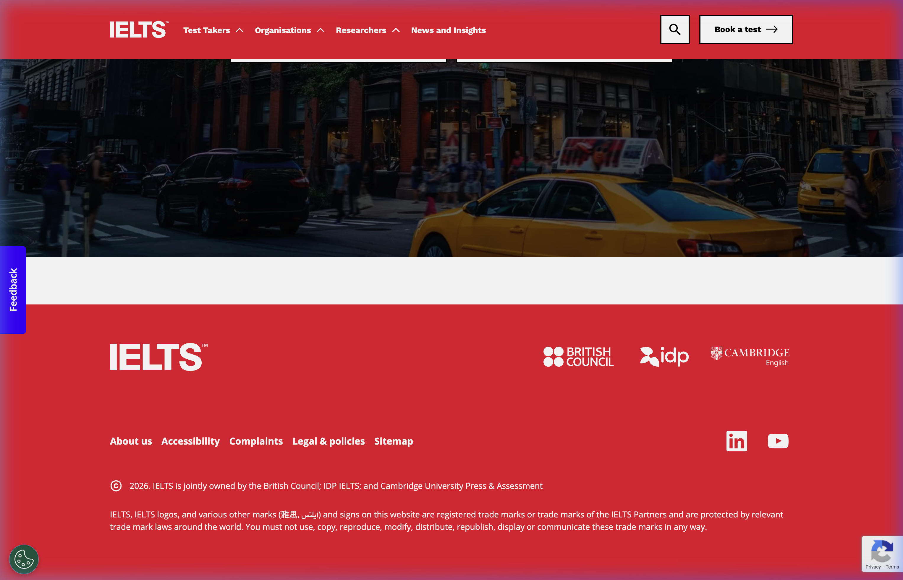
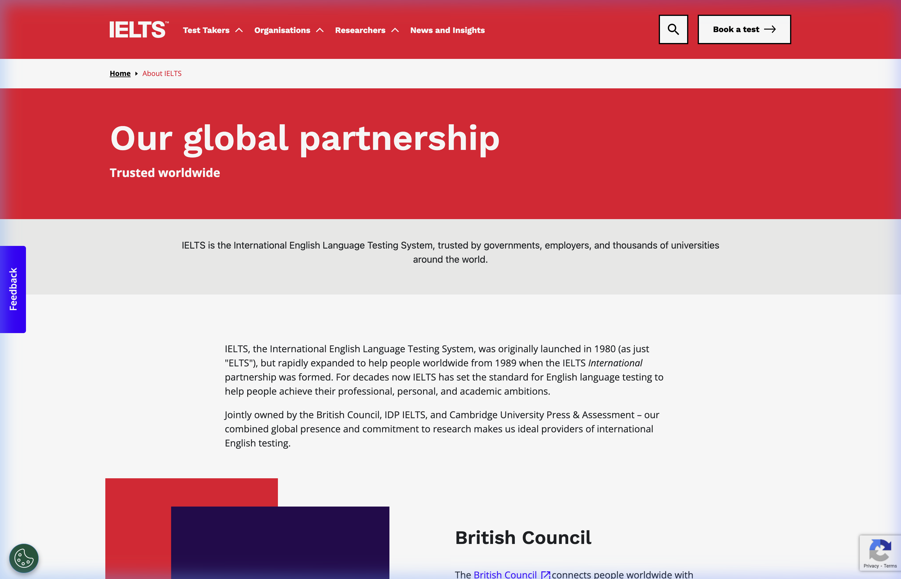
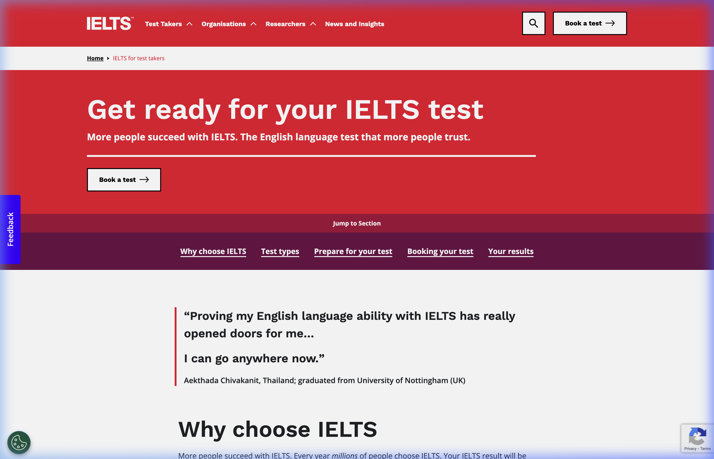
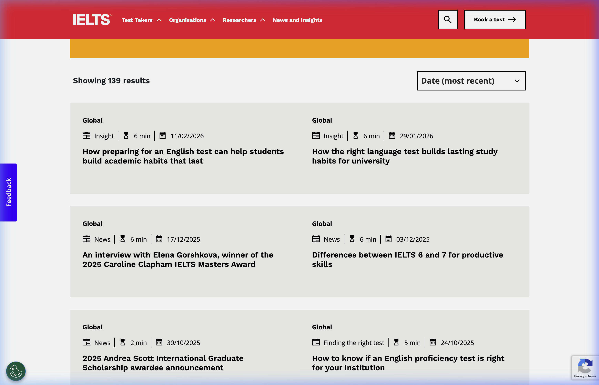

# 🔴 IELTS — Design DNA

> **Brand:** IELTS (International English Language Testing System)  
> **Owners:** British Council, IDP IELTS, Cambridge University Press & Assessment  
> **Source Sites:** [ielts.org](https://www.ielts.org), [takeielts.britishcouncil.org](https://takeielts.britishcouncil.org/)  
> **Research Date:** February 25, 2026  
> **Status:** ✅ Complete

---

## Quick Reference

| Property | Value |
|---|---|
| **Brand Archetype** | "Global Partnership Authority" — Modern, Structured, Confident, Accessible |
| **Primary Color** | IELTS Red `#E31837` |
| **Secondary Color** | BC Corporate Purple `#23085A` |
| **Headline Font** | Work Sans (ExtraBold/600–800) |
| **Body Font** | Open Sans (400–700) |
| **Button Style** | Sharp corners (`border-radius: 0px`), solid fill |
| **Design Philosophy** | "Bold Simplicity" — Massive typography and signature red commanding attention |

---

## 1. Brand Identity & Design Philosophy

IELTS presents a unique design challenge: it is **jointly owned by three organizations** (British Council, IDP, and Cambridge), each with their own brand guidelines. The result is a carefully balanced visual identity that:

- Projects **global institutional credibility** (tri-organizational endorsement)
- Maintains **bold, modern aesthetics** (oversized typography, red dominance)
- Allows **sub-brand flexibility** (BC purple vs. IELTS red on different platforms)
- Prioritizes **information accessibility** (Bootstrap foundation, clean grid, high contrast)

### The Dual-Face Identity

IELTS operates with two distinct visual faces:

| Dimension | IELTS Official (ielts.org) | British Council IELTS |
|---|---|---|
| **Visual Character** | Tech-forward, minimalist | Corporate, informative |
| **Primary Color** | Vibrant Red `#E31837` | Deep Purple `#23085A` |
| **Typography** | Work Sans (stylized) | BCSans / Arial (standard) |
| **Grid** | Flat, generous whitespace | Traditional, container-based |
| **Target Feel** | "Modern brand" | "Trusted institution" |

### Core Design Axioms

1. **Red = IELTS** — The signature red is the single most recognizable element. It appears on every hero section, every nav bar, and every primary CTA.
2. **Typography IS the Design** — With 60–90px hero headings, the text itself creates visual impact without relying on complex layouts.
3. **Sharp Professionalism** — Like ETS, IELTS uses `0px` border-radius universally, projecting institutional seriousness.
4. **Content Density Control** — Despite being information-heavy, the site uses background color alternation and massive section breaks to prevent overwhelm.

---

## 2. Color Palette

### Primary Colors

| Swatch | Name | Hex | RGB | Usage |
|---|---|---|---|---|
|  | **IELTS Red** | `#E31837` | `rgb(227, 24, 55)` | Main nav header, hero backgrounds, brand identity |
|  | **BC Purple** | `#23085A` | `rgb(35, 8, 90)` | British Council header/footer, sub-brand identity |
|  | **White** | `#FFFFFF` | `rgb(255, 255, 255)` | Hero text, button fills, content backgrounds |

### Secondary & Functional Colors

| Swatch | Name | Hex | RGB | Usage |
|---|---|---|---|---|
|  | **Accent Orange** | `#F19E00` | `rgb(241, 158, 0)` | Filter sections, secondary highlights |
|  | **Bootstrap Dark** | `#212529` | `rgb(33, 37, 41)` | Primary body text, headings on white |
|  | **True Black** | `#000000` | `rgb(0, 0, 0)` | Button text on white, strong headings, breadcrumbs |
|  | **Light Gray** | `#EBEBEB` | `rgb(235, 235, 235)` | Section backgrounds, content block separators |

### Test Paper Colors

| Swatch | Name | Hex | Note |
|---|---|---|---|
|  | **Test Paper Text** | Pantone 295 equivalent | Official IELTS test paper text color |

### CSS Variable Snippet

```css
:root {
  /* IELTS Brand */
  --ielts-red: #E31837;
  --ielts-red-dark: #C41530;       /* Hover state estimate */
  --bc-purple: #23085A;
  --bc-red-cta: #E31836;           /* BC's CTA red (near-identical) */
  
  /* Text */
  --ielts-text-primary: #212529;
  --ielts-text-black: #000000;
  --ielts-text-on-red: #FFFFFF;
  
  /* Backgrounds */
  --ielts-bg-white: #FFFFFF;
  --ielts-bg-light: #EBEBEB;
  --ielts-bg-orange: #F19E00;
  
  /* Bootstrap Overrides */
  --bs-primary: #E31837;           /* Overrides default Bootstrap blue */
  --bs-body-font-family: 'Open Sans', system-ui, sans-serif;
}
```

---

## 3. Typography

IELTS uses a **two-tier typographic system** with Google Fonts as the foundation.

### Font Stack

| Tier | Font Family | Role | Source | Fallback |
|---|---|---|---|---|
| **1 (Headlines)** | **Work Sans** | Page titles, hero text, nav, H1–H3, buttons | Google Fonts | `system-ui, sans-serif` |
| **2 (Body)** | **Open Sans** | Paragraphs, breadcrumbs, secondary text | Google Fonts | `system-ui, sans-serif` |

### British Council Variant

| Tier | Font Family | Role | Fallback |
|---|---|---|---|
| **1 (Brand)** | **BCSans** | Corporate typography (proprietary) | Arial, Helvetica, sans-serif |
| **2 (Body)** | **Arial** | Test papers, general content | Helvetica, sans-serif |

### Type Scale

| Context | Font | Size | Weight | Line Height | Notes |
|---|---|---|---|---|---|
| **Hero H1** | Work Sans | 60–90px | 600–800 | 1.1 | Extremely large, tight leading |
| **Section H2** | Work Sans | 48px | 600 | 1.2 | Section dividers |
| **Card H3** | Work Sans | 32px | 600 | 1.3 | Content block titles |
| **Nav Links** | Work Sans | 14px | 700 | 1.5 | Bold for scanability |
| **Body Text** | Open Sans | 16px | 400 | 1.6 | Generous line height |
| **Breadcrumbs** | Open Sans | 12px | 700 | 1.4 | All caps, tracked |
| **"Book a test" CTA** | Work Sans | 14px | 700 | 1.0 | High-visibility styling |

### Font Import

```css
@import url('https://fonts.googleapis.com/css?family=Open+Sans:300,400,600,700');
/* Work Sans is loaded via separate stylesheet or @font-face */
```

> [!NOTE]
> **Test Paper Typography**: Official IELTS test papers use Arial 11pt (standard) or Arial 18pt Bold (enlarged print version). This is a strikingly different typographic approach from the website, prioritizing raw legibility over brand expression.

---

## 4. Layout & Spatial Design

### Page Architecture

```
┌──────────────────────────────────────────────────┐
│  GLOBAL NAV (bg: #E31837, sticky)                │
│  IELTS Logo | Test Types ▾ | Book a Test | ☰     │
├──────────────────────────────────────────────────┤
│                                                  │
│  HERO SECTION                                    │
│  Full-width photography / solid red fill          │
│  60–90px white headline text, centered            │
│  Padding: 60–100px vertical                      │
│                                                  │
├──────────────────────────────────────────────────┤
│  BREADCRUMBS                                     │
│  Open Sans 12px / Bold / All caps                │
├──────────────────────────────────────────────────┤
│                                                  │
│  CONTENT SECTIONS                                │
│  Alternating white / light gray (#EBEBEB) blocks │
│  Bootstrap grid (container-based)                │
│  Card layouts (borderless, shadowed)              │
│                                                  │
├──────────────────────────────────────────────────┤
│  FOOTER (bg: dark gray/purple)                   │
│  Multi-column links | Partner logos              │
│  Social media icons | Legal                      │
└──────────────────────────────────────────────────┘
```

### Spacing System

| Token | Value | Usage |
|---|---|---|
| **Hero Padding** | 60–100px | Vertical padding in hero sections |
| **Section Padding** | 40–60px | Vertical padding between content blocks |
| **Card Gap** | 20–30px | Space between grid cards |
| **Container Max-Width** | ~1140px | Bootstrap container (standard lg) |
| **Nav Height** | ~56px | Sticky red navigation bar |

### Framework

> [!IMPORTANT]
> The IELTS website is built on **Bootstrap**, heavily customized with brand overrides. This is evident from the extensive `--bs-*` CSS custom properties on `:root`. Key Bootstrap defaults are overridden:
> - `--bs-primary`: Changed from Bootstrap blue to IELTS red
> - `--bs-body-font-family`: Set to Open Sans stack
> - `--bs-border-radius-lg`: `0.5rem` (though rarely used in practice)

### Key Layout Patterns

1. **Full-Width Red Headers** — Hero sections filled with IELTS Red create an instantly recognizable brand impression
2. **Photography Overlays** — White text directly overlaid on high-quality urban/lifestyle photography
3. **Card Collections** — News and content cards laid out in 3-column Bootstrap grids, borderless with background tinting
4. **"Jump to Section" Bars** — Sub-navigation bars below heroes for quick page navigation (especially on Test Takers pages)

---

## 5. Interactive Design

### Button System

| Variant | Background | Text Color | Border | Border Radius | Font | Weight |
|---|---|---|---|---|---|---|
| **"Book a test" (Primary)** | `#FFFFFF` | `#000000` | 1px solid black | `0px` | Work Sans | 700 |
| **CTA (BC variant)** | `#E31836` | `#FFFFFF` | None | `0px` | BCSans/Arial | 700 |
| **Secondary / Ghost** | Transparent | `#FFFFFF` or `#000` | 1px solid | `0px` | Work Sans | 600 |
| **Disabled** | `#CCCCCC` | `#666666` | None | `0px` | — | — |

### Hover & Interaction States

- **"Book a test" button**: Background shifts from white to light gray, maintaining contrast
- **Navigation links**: Subtle opacity change or underline appearance
- **Cards**: Background color subtly darkens or shadow increases on hover
- **Red header**: Transitions from transparent to solid red on scroll (sticky behavior)

### Micro-Patterns

- **Arrow Icons**: Thin-stroke arrows (→) used in CTAs for directional guidance
- **Hourglass**: Used as a "reading time" indicator on articles
- **Calendar Icon**: Date markers on news cards
- **Social Icons**: Monochromatic, consistent size on footer

---

## 6. Navigation Architecture

### IELTS Official Navigation

- **Background**: `#E31837` (Signature Red)
- **Height**: ~56px
- **Behavior**: Sticky — transitions from transparent to opaque red on scroll
- **Layout**: Logo (left) | Dropdown nav (center-right) | "Book a test" CTA (right) | Hamburger (mobile)
- **Font**: Work Sans, 14px, weight 700, white text
- **Dropdown Indicator**: Upward caret `^` for expandable sections

### British Council Navigation

- **Background**: `#23085A` (Corporate Purple)
- **Height**: ~60px
- **Behavior**: Static or mildly sticky
- **Layout**: BC Logo + IELTS Logo (left) | Mega-menu nav (center) | "Book" CTA (right)
- **Style**: More comprehensive — mega-menu style with grouped link categories

### Footer

- **IELTS Official**: Relatively compact, dark background, tri-partner logos (BC + IDP + Cambridge), social icons, minimal legal
- **British Council**: Very deep footer, multiple column groups, extensive link tree, social icons, corporate disclaimers over `#23085A` purple

---

## 7. Visual Elements

### Photography Style

- **IELTS Official**: High-quality urban/cityscape lifestyle photography. Subjects positioned in real-world contexts (streets, campuses, offices). Warm, aspirational tone.
- **British Council**: Similar lifestyle photography but often tighter crops, more institutional backdrops (classrooms, libraries)
- **Treatment**: Images are always full-bleed or nearly full-width. White text overlaid directly (no frosted glass or gradient overlays).

### Iconography

- **Style**: Thin-line, monochromatic, minimal
- **Colors**: White on red backgrounds, dark on white backgrounds
- **Usage**: Utility-focused (reading time, dates, arrows) rather than decorative
- **Grid**: Consistent sizing (~16–20px)

### Partner Logos

A distinctive visual element: the IELTS brand always displays the **three partner logos** together:
- British Council (purple wordmark)
- IDP IELTS (blue wordmark)
- Cambridge (shield crest)

This tri-logo arrangement appears on footers, test materials, and official communications, reinforcing shared governance.

---

## 8. Core Design Principles

| # | Principle | Description | Visual Manifestation |
|---|---|---|---|
| 1 | **Red = Identity** | The signature red IS the brand; it is non-negotiable | Solid red hero fills, red nav bar, red CTAs |
| 2 | **Scale = Impact** | Oversized typography creates immediate visual hierarchy | 60–90px hero headings, ExtraBold weights |
| 3 | **Partnership Balance** | Three owners, one visual identity | Tri-logo display, neutral-tone content areas |
| 4 | **Accessible Information** | Serves millions globally with varying design literacy | Bootstrap grid, high contrast, clear hierarchy |
| 5 | **Professional, Not Cold** | Approachable but authoritative | Warm photography, bold but clean typography |

---

## 9. Design DNA Mindmap



---

## 10. Comparison: IELTS vs. ETS Design Systems

For cross-reference with the [ETS/TOEFL Design DNA](../ets-toefl-design-dna/):

| Dimension | ETS / TOEFL | IELTS |
|---|---|---|
| **Primary Color** | Deep Navy `#1A212B` | Vibrant Red `#E31837` |
| **Emotional Tone** | Reserved, authoritative | Bold, confident |
| **Font Strategy** | Custom self-hosted (Beausite, Greet) | Google Fonts (Work Sans, Open Sans) |
| **Framework** | Custom React components | Bootstrap with brand overrides |
| **Test Interface Font** | Arial/Helvetica (system) | Arial 11pt (identical approach) |
| **Border Radius** | 0px everywhere | 0px everywhere |
| **Hero Approach** | Photography with overlapping cards | Photography with direct text overlay |
| **Governance** | Single org (ETS) | Tri-partnership (BC, IDP, Cambridge) |

> [!TIP]
> Both brands converge on a shared principle: **test interface typography must use system fonts (Arial) for pixel-perfect parity across test centers worldwide**. This is a critical insight for Antigravity's engine — the marketing site and test shell are fundamentally different design systems.

---

## 11. Visual Reference Gallery

### IELTS Homepage — Hero Section


### IELTS Homepage — Content Mid-Section


### IELTS Homepage — Full Page View


### British Council IELTS — Full Page


### IELTS About — Hero Section


### IELTS Test Takers — Hero Section


### IELTS News Cards


### Full Browsing Recordings

- [IELTS Visual Reconnaissance Recording](assets/ielts_visual_recon_1772010815641.webp) — Full scroll-through of ielts.org and takeielts.britishcouncil.org
- [IELTS Deeper CSS Analysis Recording](assets/ielts_deeper_analysis_1772011312906.webp) — CSS extraction from About and Test Takers pages

---

*Research conducted using browser-based visual reconnaissance, JavaScript CSS extraction, and web research.*
