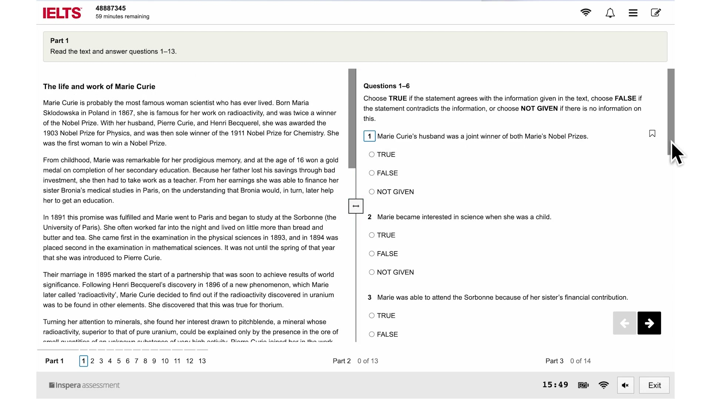
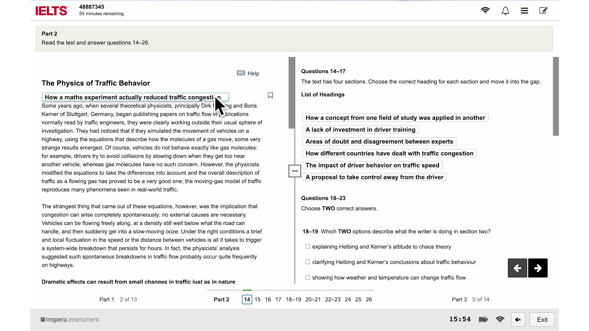
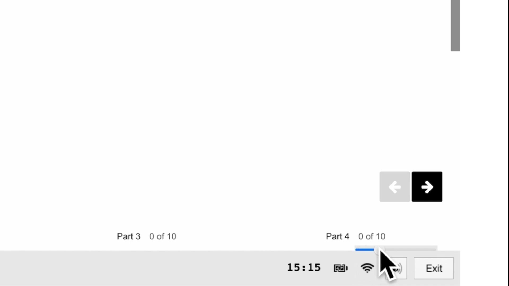
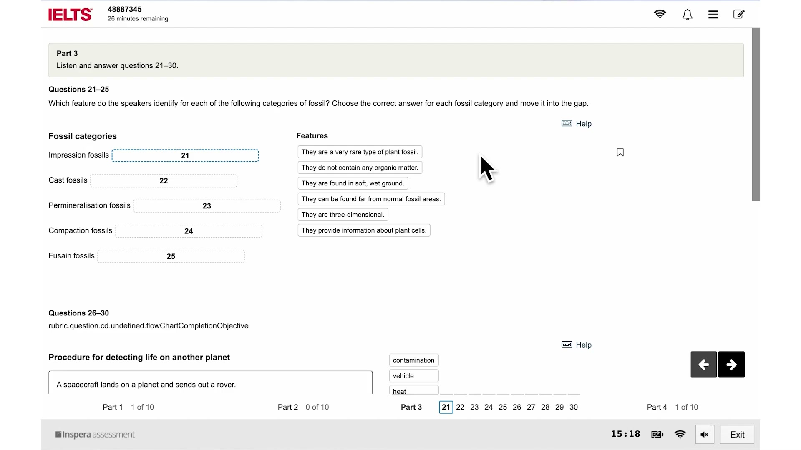
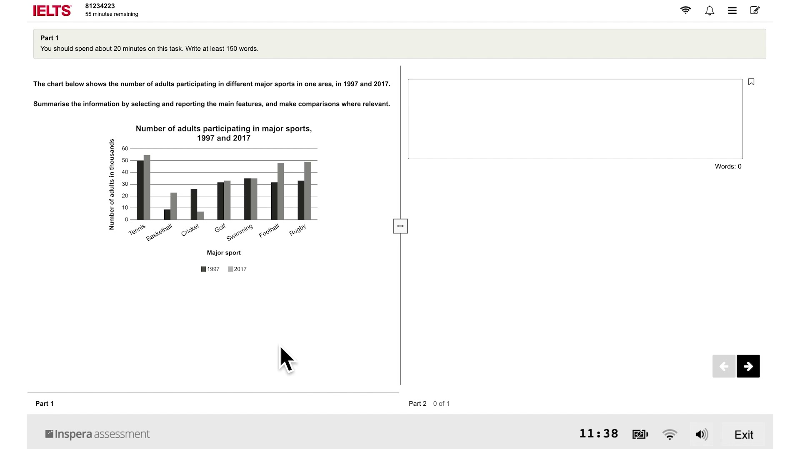
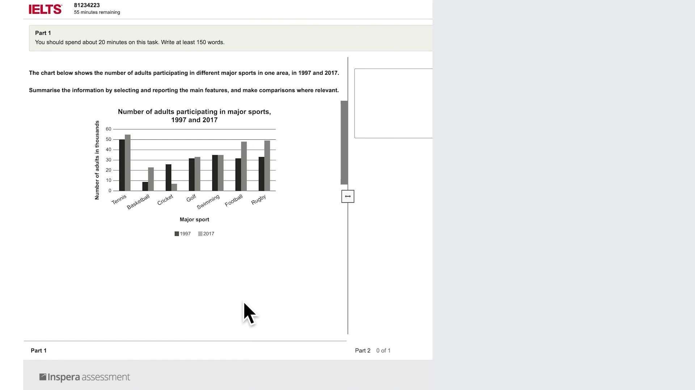

# CD-IELTS Test Interface Research

Last verified: 2026-02-25

## Sources
| ID | Source | Type | URL |
|----|--------|------|-----|
| S1 | IDP CD-IELTS Familiarisation | Primary (official) | `https://ielts.idp.com` |
| S2 | British Council CD-IELTS Guide | Primary (official) | `https://takeielts.britishcouncil.org` |
| S3 | IELTS Official YouTube Tutorials | Primary (official) | Official IELTS YouTube Channels |
| S4 | Test Prep Forums/Threads | Tertiary (community) | Reddit r/IELTS |

## Variance Log
### VAR-001: Next/Back Navigation Buttons
| Source | Claim |
|--------|-------|
| S1 | IDP tutorial shows direct number-box clicking for navigation. |
| S2 | British Council versions sometimes include specific "Next" and "Back" buttons in the bottom right. |
**Resolution**: Both navigation methods exist. The UI should prioritize the numbered bottom bar for direct access, as it is universal across both providers [S1, S2].

## Interface Layout & Mechanics

### General Framework
The CD-IELTS interface prioritizes high contrast and accessibility, utilizing a stark black, white, and grey color palette to reduce eye fatigue [S1, S2].
*   **Top Bar:** Solid black/dark grey. Displays Candidate ID (Left), Section Name (Center), and Timer (Right) [S1, S2].
*   **Timer Behavior:** The top-right countdown clock flashes red at exactly 10 minutes and 5 minutes remaining [S1, S2, S3].
*   **Accessibility Settings:** Top right toggles for text size and color contrast (e.g., standard, yellow on black) [S1, S2].

### Lower Navigation Bar
Unlike TOEFL's top-right navigation, IELTS centralizes all movement at the bottom of the screen [S1, S2, S3].
*   **Numbered Grid:** A horizontal row of square boxes tracks all questions in the section.
*   **Status Indicators:**
    *   *Answered:* Black underline beneath the question number [S1, S2].
    *   *Review:* Circular dot inside the number box (Test-takers can flag items for review) [S2, S3].
    *   *Active:* Blue or bold border highlighting the currently unselected question [S1].

### Section-Specific Mechanics
*   **Reading (Split Screen):** The screen uses a hard 50/50 vertical split. The left pane holds the reading passage; the right pane displays the questions. Crucially, each pane scrolls completely independently [S1, S3].
*   **Writing (Word Count):** An automatic word counter is located at the bottom of the text input box (right pane), updating in real-time. Auto-save is continuous [S1, S3].
*   **Listening (Volume):** A volume slider appears in the bottom right corner. Questions are typically centered in a large single pane or a 2/3 width layout [S1, S2, S3].
*   **Tools:** Right-clicking text allows for highlighting (yellow) or adding yellow sticky notes [S1, S3].

## Media References (Video Tutorials)

To visually supplement this interface research, the following official tutorial videos demonstrate the CD-IELTS test shell in action.

| Section | Content | URL |
|---------|---------|-----|
| **General** | IELTS on computer - Quick Guide | [Watch on YouTube](https://www.youtube.com/watch?v=4_dCncUPBO4) |
| **Reading** | Reading test tutorial (Shows split-screen and highlighting) | [Watch on YouTube](https://www.youtube.com/watch?v=dsCXG9kfRgk) |
| **Listening** | Listening test tutorial (Shows volume controls and navigation) | [Watch on YouTube](https://www.youtube.com/watch?v=_O2RHxsAugg) |
| **Writing** | Writing test tutorial (Shows text input and word count) | [Watch on YouTube](https://www.youtube.com/watch?v=vteGnnQCuAs) |

## Visual Interface Gallery

### Reading Section

### Listening Section

### Writing Section

