# TOEFL iBT 2026 Interface Research

Last verified: 2026-02-25

## Sources
| ID | Source | Type | URL |
|----|--------|------|-----|
| S1 | ETS Official Announcements | Primary (official) | `https://www.ets.org/toefl/test-takers/ibt/about.html` |
| S2 | TOEFL 2026 Practice Interface | Primary (official) | `https://v2.test.toefl.org` |
| S3 | Antigravity Design Spec | Primary (official) | `DOCUMENTATION OUTLINE- Authentic TOEFL iBT 2026 Interface.rtf` |
| S4 | Prep Site Synthesis | Secondary (expert) | BestMyTest, Study.com, Galvanize |

## Variance Log
### VAR-001: Test Duration
| Source | Claim |
|--------|-------|
| S4 | Prep sites claim 67-85 minutes for the shortened test. |
| S3 | Antigravity spec confirms 67-minute precise duration model. |
**Resolution**: Adopt 67 minutes as the baseline minimum duration for the new paradigm [S3, S4].

### VAR-002: CEFR Scoring Alignment
| Source | Claim |
|--------|-------|
| S1 | Mention of bands aligned with CEFR. |
| S4 | Secondary sources mention a transition period displaying both 1-6 scale and 0-120 scale. |
**Resolution**: The interface will implement the 1.0-6.0 Band Scale natively while supporting the legacy 0-120 score calculation during the 2026 transition window [S1, S4].

## Core Paradigm Shift: 2026 Format

The TOEFL iBT 2026 update represents a complete paradigm shift, fundamentally altering specific structural elements of the exam [S1, S3, S4].

### Multi-Stage Adaptive Testing (MST)
The most significant change to the interface mechanics is the introduction of Multi-Stage Adaptive Testing for the Reading and Listening sections [S1, S4].
*   The difficulty of the questions presented in later stages adjusts in real-time based on the test-taker's performance in the preceding stages [S4].
*   For the Antigravity engine, this requires implementing a dynamic branching logic inside the `TestSequencer`, where the next component is selected from a pool based on real-time calculated logits or correct-answer ratios.

### New Task Types & Integration
The 2026 test interface merges previously distinct test types by introducing highly integrated communicative tasks [S1, S3, S4].
*   **Reading:** "Complete the Words" and "Read in Daily Life" [S3, S4].
*   **Listening:** "Listen and Choose a Response" and "Listen to an Announcement" [S3, S4].
*   **Writing:** "Build a Sentence" and "Write an Email" [S3, S4].
*   **Speaking:** "Listen and Repeat" and "Take an Interview" [S3, S4].

### Interface Aesthetics & Lockdown
Despite the structural changes, the core UI aesthetics of the testing shell remain strict to ensure security and accessibility parity worldwide [S3].
*   **Typography:** The test interface mandates the use of Arial/Helvetica 16px (Reading) and 15px (Questions), avoiding the modern Beausite/Greet font stack used on ETS's marketing sites [S3].
*   **Colors:** Deep Navy canvas (`#1A212B`), ETS Primary Blue (`#005587`) for buttons, and Alert Red (`#D32F2F`) for the timer (≤5 minutes) [S3].
*   **Security Shell:** The secure browser environment (ETS Secure Test Browser for Home Edition or identical test center shell) strictly prevents background application multitasking and locks the viewport [S3, S1].

## Media References (Video Tutorials)

To visually supplement this interface research, the following videos demonstrate the anticipated TOEFL 2026 format and the specific test shell mechanics.

| Task Type | Content | URL |
|-----------|---------|-----|
| **Full Test** | Complete TOEFL iBT Practice Test (2026 format) | [Watch on YouTube](https://www.youtube.com/watch?v=5giZh7nDyfk) |
| **Speaking** | Take an Interview (New 2026 Task) | [Watch on YouTube](https://www.youtube.com/watch?v=SWngcqDFYDs) |
| **Speaking** | Listen and Repeat (New 2026 Task) | [Watch on YouTube](https://www.youtube.com/watch?v=8DyLYsi9dLQ) |
| **Writing** | Academic Discussion / Write an Email | [Watch on YouTube](https://www.youtube.com/watch?v=WqCcgHe2BVM) |

## Visual Interface Gallery

### Reading Section
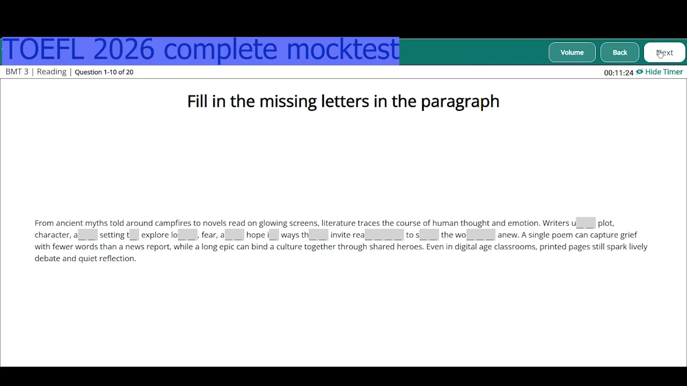
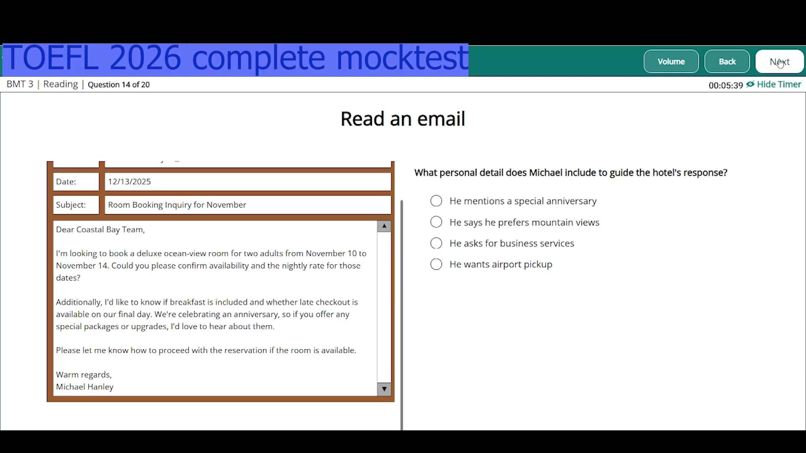
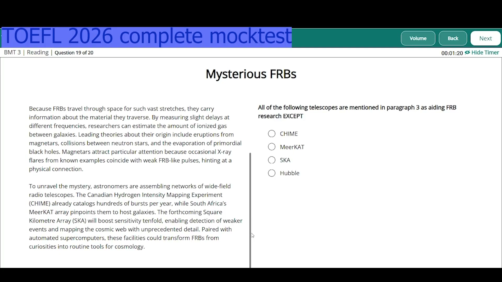

### Listening Section
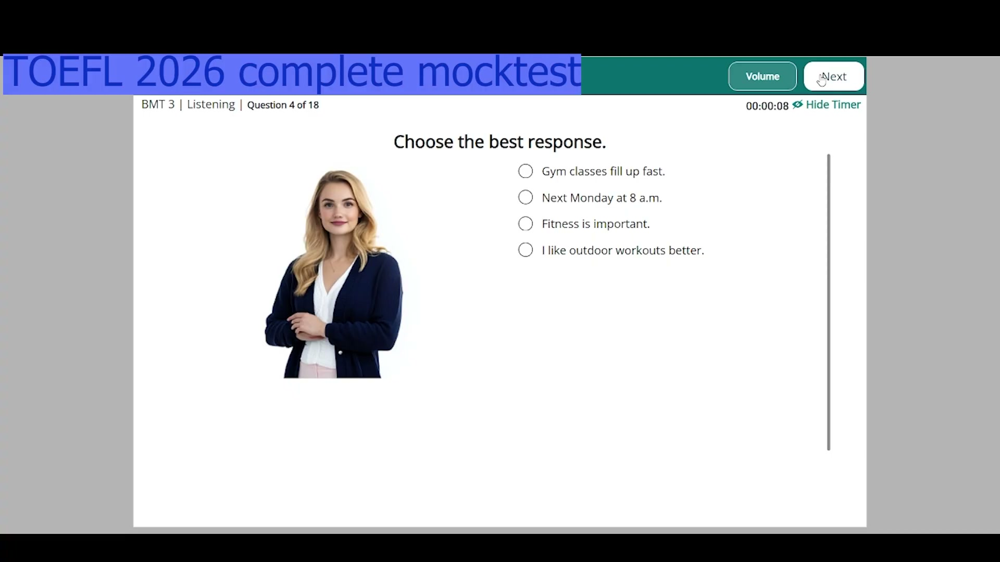
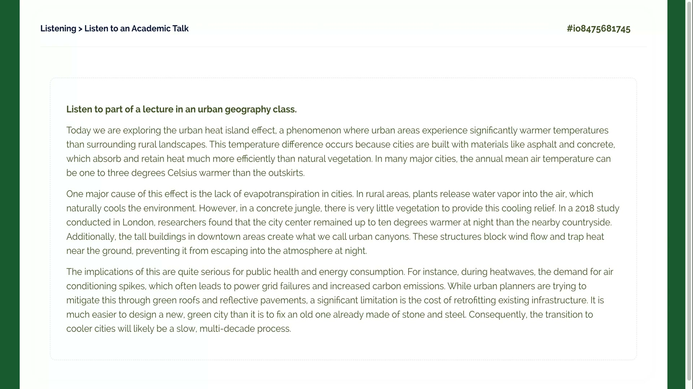
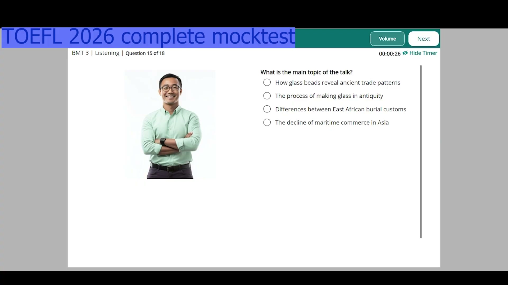
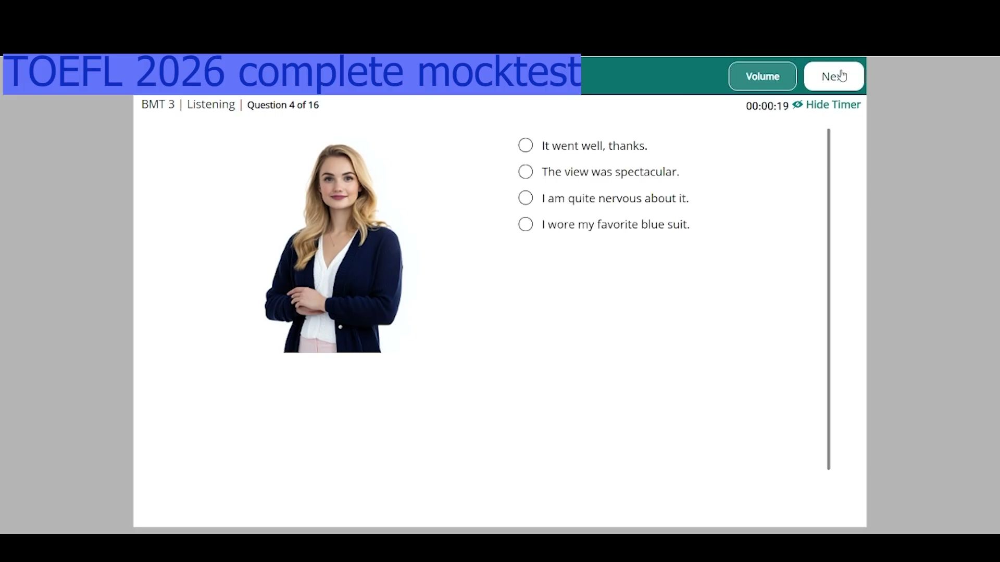

### Speaking Section
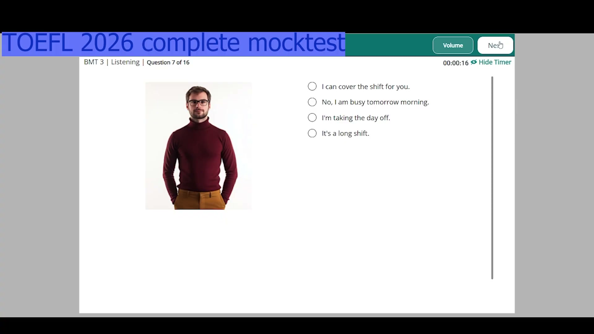
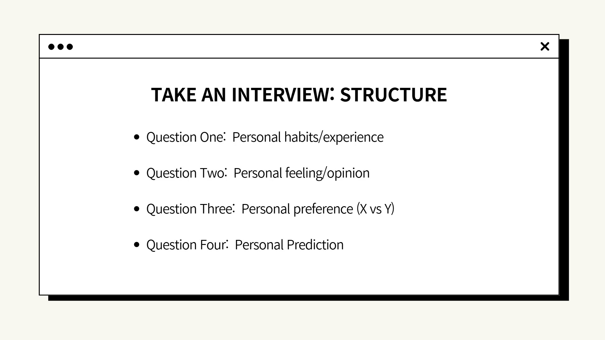
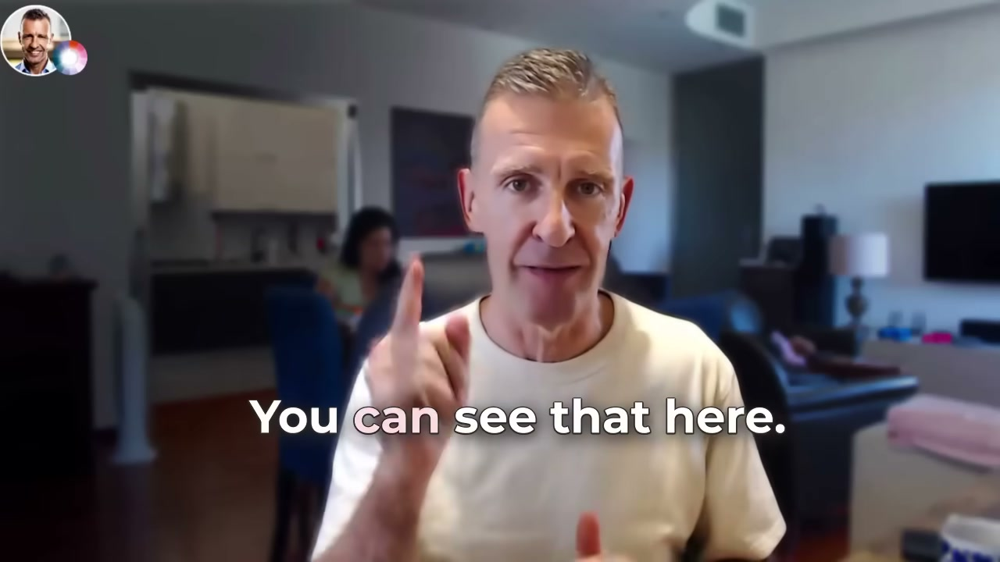

### Writing Section
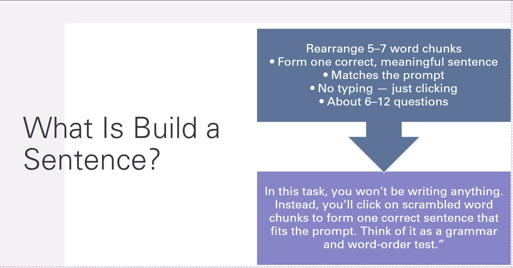
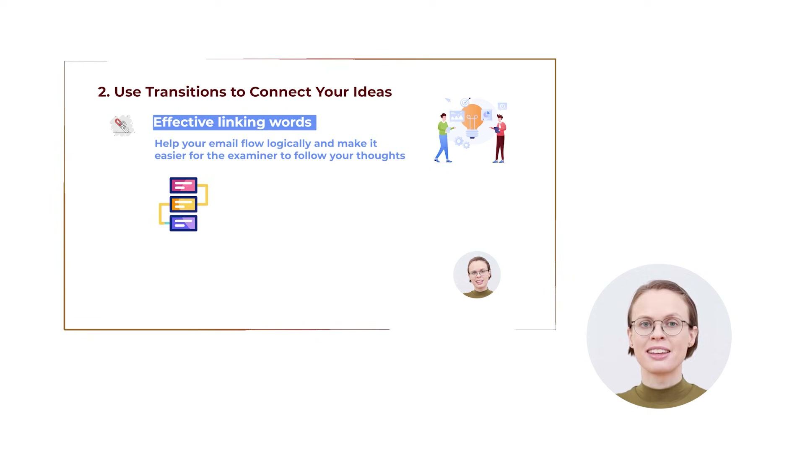
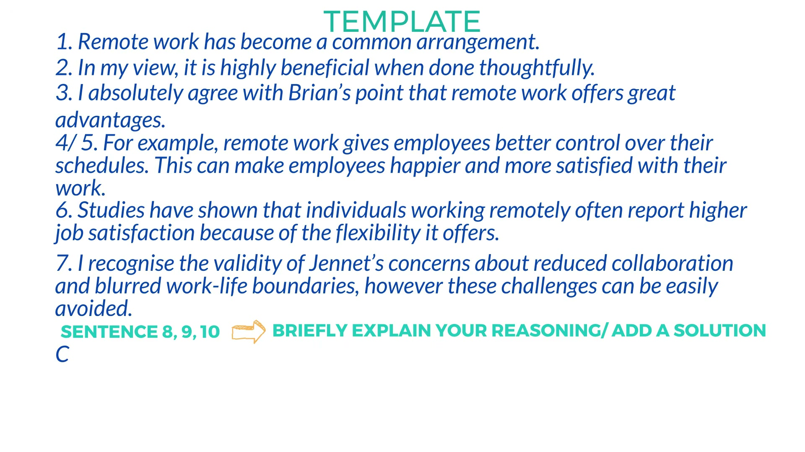
